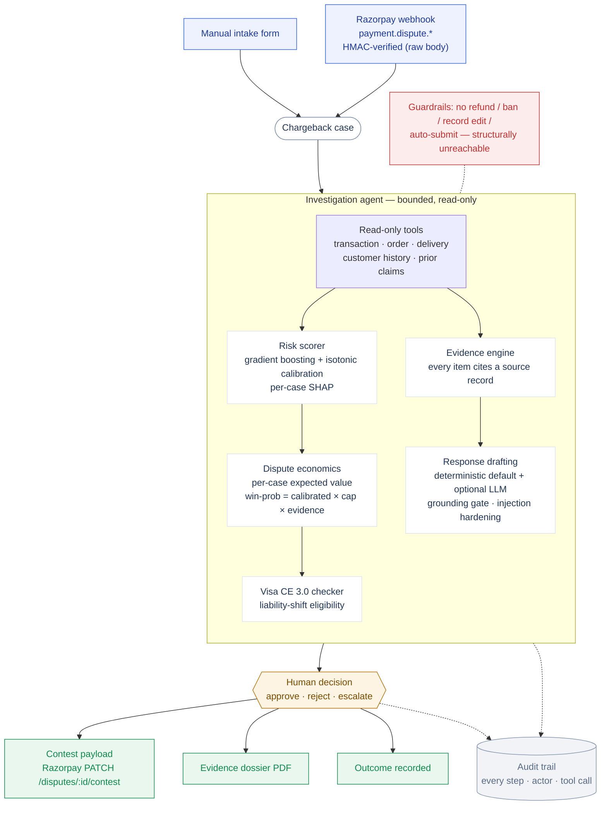

# ChargeLens

A dispute console for Razorpay merchants that decides which chargebacks
are worth fighting — and proves every number it shows.

Chargebacks quietly eat merchant margin: friendly fraud ("item not
received" on a signed delivery) wins by default when the merchant misses
a response deadline or submits weak evidence, while fighting every
dispute burns fees on cases that were never winnable. ChargeLens scores
each dispute with a calibrated model, assembles the evidence file,
computes whether contesting is worth it *in rupees*, drafts the response
— and then stops. A human approves every action. Nothing is submitted,
refunded, or spent by the system on its own.

Built for the Razorpay AI Buildathon, track 02 (AI Risk Manager).
Defense-only by construction.

## Run it

Docker (one container, UI + API on one port):

```bash
docker build -t chargelens . && docker run -p 8000:8000 chargelens
```

Or directly:

```bash
./run.sh
```

Either way, open http://localhost:8000 — demo data seeds itself on
first boot. For development, `npm --prefix frontend run dev` gives a
hot-reloading UI on :5173 proxying to the API.

All data is synthetic (5,000 generated cases; see
`backend/data/manifest.json`). No real customer data anywhere.

## Architecture



The scorer is a calibrated GBM, not an LLM — dispute risk needs auditable
probabilities and per-feature attributions. The only LLM step is drafting
language, and it is gated: the grounding check discards any draft that
introduces a number or identifier not on the record, falling back to the
deterministic letter. A human approves every action; the agent's tool
registry is the sole dispatch path, so money movement and record edits
are unreachable rather than merely forbidden.

## What happens to a dispute

1. **Intake** — a case arrives via the UI form or the Razorpay
   `payment.dispute.created` webhook (`/api/webhooks/razorpay`,
   HMAC-verified over the raw body, per Razorpay's contract).
2. **Investigation** — a bounded agent works through read-only tools
   (transaction, order, delivery, customer history, prior claims). The
   tool registry is the only dispatch path; refunds, bans, and record
   edits are not "discouraged", they are unreachable.
3. **Risk score** — a gradient-boosted model with isotonic calibration
   outputs the probability the dispute is abusive, with per-case SHAP
   attributions. Thresholds were tuned on a validation split against
   rupee costs, never on the test set.
4. **Economics** — the decision to fight is expected value, not vibes:
   `EV(contest) = p_win × (1 − pre-arb haircut) × amount − fee − ops`.
   The modeled win probability is deliberately *not* the risk score: it
   is capped by industry representment outcomes per reason type and
   scaled by evidence strength, because a calibrated fraud probability
   is not a win probability. The dispute fee is treated as sunk — in the
   Razorpay ecosystem it is not refunded even when you win. A ₹900
   dispute at 99% confidence is correctly refused as uneconomic; the
   break-even win probability falls as the amount rises.
5. **Evidence & draft** — every evidence item cites the exact source
   record and field. The response letter is deterministic by default;
   optionally an LLM redrafts it, gated by a grounding check (numbers
   and identifiers must exist in the trusted facts or the draft is
   discarded for the deterministic one).
6. **Human decision** — the case parks in `awaiting_review`. Approve,
   reject, or escalate; the audit trail records every step, actor, and
   tool call along the way. For contest-approved cases the system emits
   a payload matching Razorpay's real `PATCH /v1/disputes/:id/contest`
   schema — with `action: "draft"`, because submission is a human step.

## Honest metrics

The Model Performance page is generated by the evaluation pipeline on a
held-out test split (never used for training, model selection,
calibration, or threshold tuning) — nothing is hand-entered. Headline
numbers on the current model: precision 86.5% / recall 84.0% at the
contest threshold, ROC-AUC 0.939, PR-AUC 0.898 — and, just as
prominently: **85 honest customers would have been flagged, at an
estimated cost of ₹1.06L**. False positives are a cost, not a rounding
error; the threshold was chosen to minimize total rupee cost, not to
maximize a leaderboard metric.

Because the data is synthetic, these numbers measure the pipeline's
discipline, not real-world performance — the model card says so, and
the demo says so. The methodology (leak-free splits, calibration before
thresholding, cost-based tuning) is the part that transfers.

## The safety layer is measured, not asserted

The response drafter is the only place an LLM writes text, and the claim
the disputing customer types is the one input an attacker controls. Both
risks are measured, and the numbers run in CI so a regression fails the
build (`python -m scripts.eval_safety` prints them):

- **Grounding gate** — a perturbation benchmark corrupts 100 clean
  drafts across a fact-level taxonomy (swapped amounts, dates, IDs,
  fabricated quantities, unsupported numbers). The numeric/identifier
  gate catches **100% of in-scope corruptions with a 0% false-block
  rate**. It honestly reports what it cannot see: a purely qualitative
  fabrication introduces no new number or ID, so that family is counted
  separately as out-of-scope rather than excluded to inflate the
  headline — which is exactly why the deterministic generator is the
  default and a human reviews every letter.
- **Injection red-team** — 17 hostile `claim_description` fixtures
  across 8 families (direct override, fake system tags, fence-break,
  markdown/HTML smuggling, base64/leetspeak encoding, zero-width
  smuggling, Hinglish, and authority/urgency social engineering) run
  through the full pipeline. **Attack success rate: 0%.** An attack
  "succeeds" if it plants a canary, flips the recommendation, breaks the
  untrusted-text fence, or launders a fabricated number into the
  grounding allow-list. Defenses: NFKC canonicalization, control- and
  zero-width-character stripping, datamarking/spotlighting, and a
  per-request random boundary fence around all customer text
  (`app/llm/hardening.py`).

## Where AI is used — and where it deliberately isn't

- **Scoring**: a GBM, not an LLM. Dispute risk needs calibrated,
  auditable probabilities and per-feature attributions; a language
  model provides neither.
- **Decisioning**: closed-form expected value. No model at all — the
  formula is printed on the case page.
- **Drafting**: the only LLM step, optional, grounded against the
  evidence file, with a deterministic fallback on any failure or
  refusal. The claim text a disputing customer writes is treated as
  untrusted input end to end.
- **Approval**: a person. Always.

## Razorpay integration

- Webhooks: the six real dispute events (`created`, `won`, `lost`,
  `closed`, `under_review`, `action_required`), signature-verified with
  HMAC-SHA256 over the raw body. Unsigned intake is not a mode — without
  a configured secret the endpoint refuses.
- Deadlines: every case carries `respond_by`; the queue sorts by it and
  the UI counts down. UPI disputes ride a shorter track than card
  disputes, because in India ~85% of digital payments are UPI and NPCI
  windows are days, not weeks.
- Contest: `GET /api/cases/{id}/contest-payload` returns a payload that
  validates against the live contest schema, using Razorpay's named
  evidence categories (`shipping_proof`, `billing_proof`,
  `access_activity_log`, …). With test keys configured it can be sent;
  without them it is an inspectable dry run.

See a dispute arrive live: start the server with a webhook secret and
fire a correctly-signed event —

```bash
CHARGELENS_RZP_WEBHOOK_SECRET=whsec_demo ./scripts/simulate_webhook.sh
```

— then refresh the queue; the new dispute appears with its `respond_by`
countdown. A forged signature is rejected with 401.

Environment: `CHARGELENS_RZP_WEBHOOK_SECRET` (webhook verification),
`RAZORPAY_KEY_ID`/`RAZORPAY_KEY_SECRET` (connected mode, optional),
`CHARGELENS_ANTHROPIC_API_KEY` (LLM drafting, optional),
`CHARGELENS_DISPUTE_FEE_INR`/`CHARGELENS_CONTEST_OPS_COST_INR` (your
fee schedule).

## What broke

The first cost model double-counted recovered revenue on contested
disputes, inflating the headline savings roughly 2×, and the threshold
tuning was reading the same labels it was later evaluated on. An
adversarial review caught both. The fix was a rebuilt evaluation
pipeline with a strict train/validation/test discipline and a cost
matrix audited line by line — and the honest numbers that came out were
*lower*. We kept them. That trade — a smaller number you can defend
over a bigger one you can't — is the design principle of the whole
product.

## Repository map

```
backend/
  app/            FastAPI app: cases, dashboard, analytics, webhooks
    agent/        bounded orchestrator + decision policy (guardrails)
    decision/     dispute economics (EV, win-probability model)
    evidence/     evidence assembly, every item cites its source
    integrations/ Razorpay webhook verification + contest payloads
    llm/          deterministic generator + grounded LLM redraft
    risk/         model loading and scoring
  riskmodel/      data generation, training, evaluation pipeline
  tests/          58 tests: guardrails, API, economics, webhooks, costs
frontend/         React console (Vite + TypeScript)
docs/RESEARCH.md  the research behind the economics and roadmap
```

## Limitations

Synthetic data; win-probability priors are industry-cited anchors, not
fitted parameters; the grounding check validates numbers and
identifiers, not qualitative phrasing (which is why the deterministic
generator is the default and a human reviews everything); UPI dispute
semantics are modeled at the deadline/workflow level, not full URCS
lifecycle. The roadmap in `docs/RESEARCH.md` addresses each.
